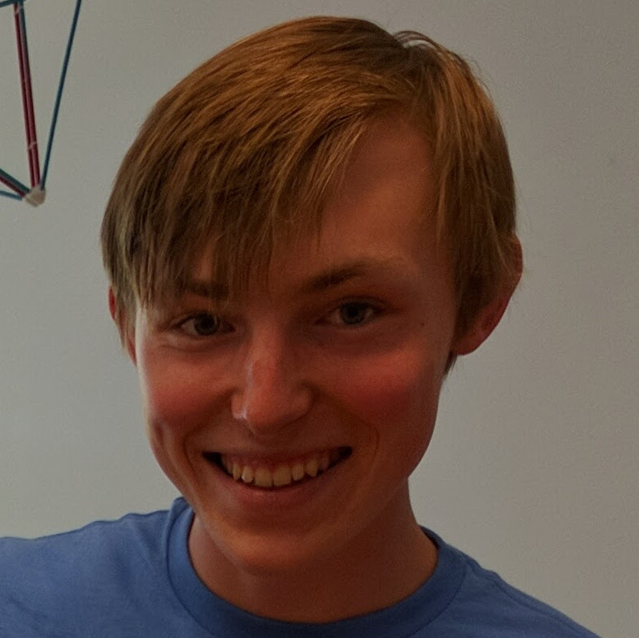
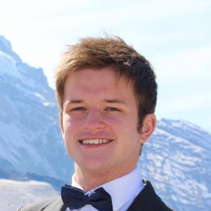
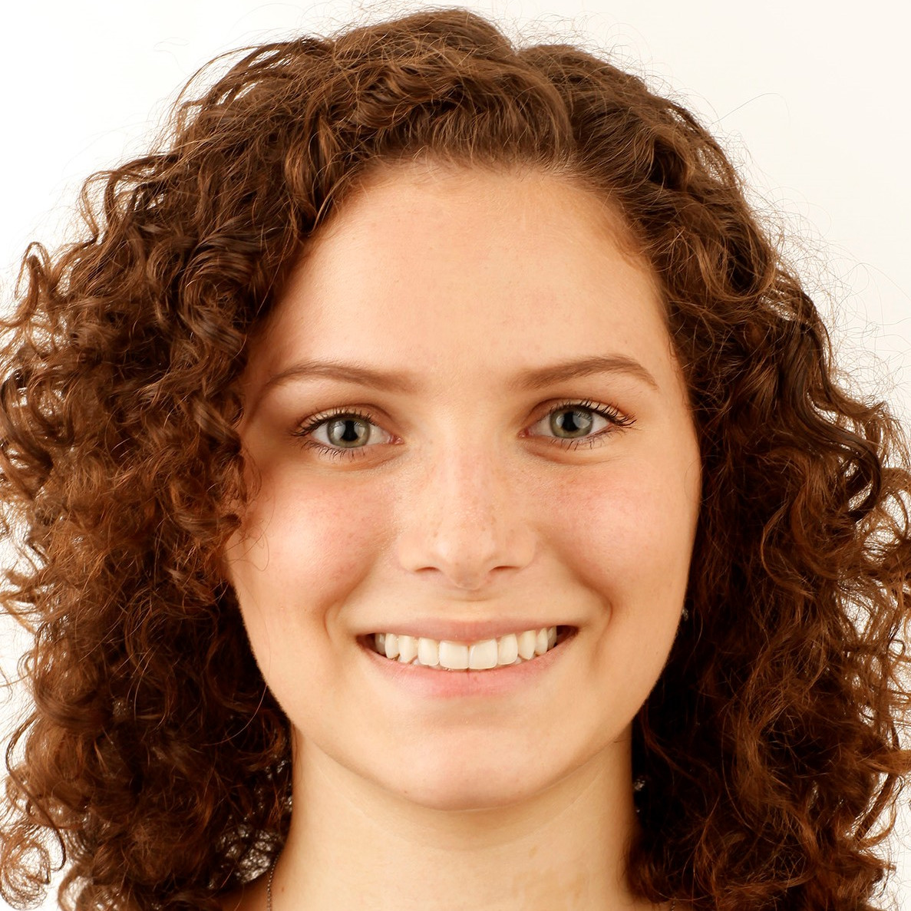
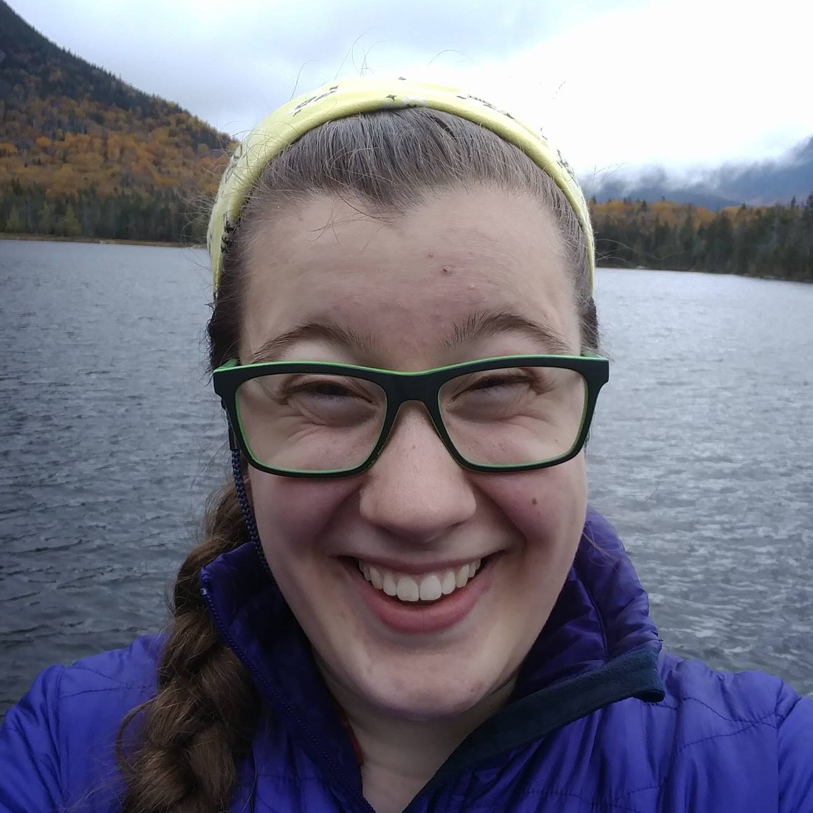
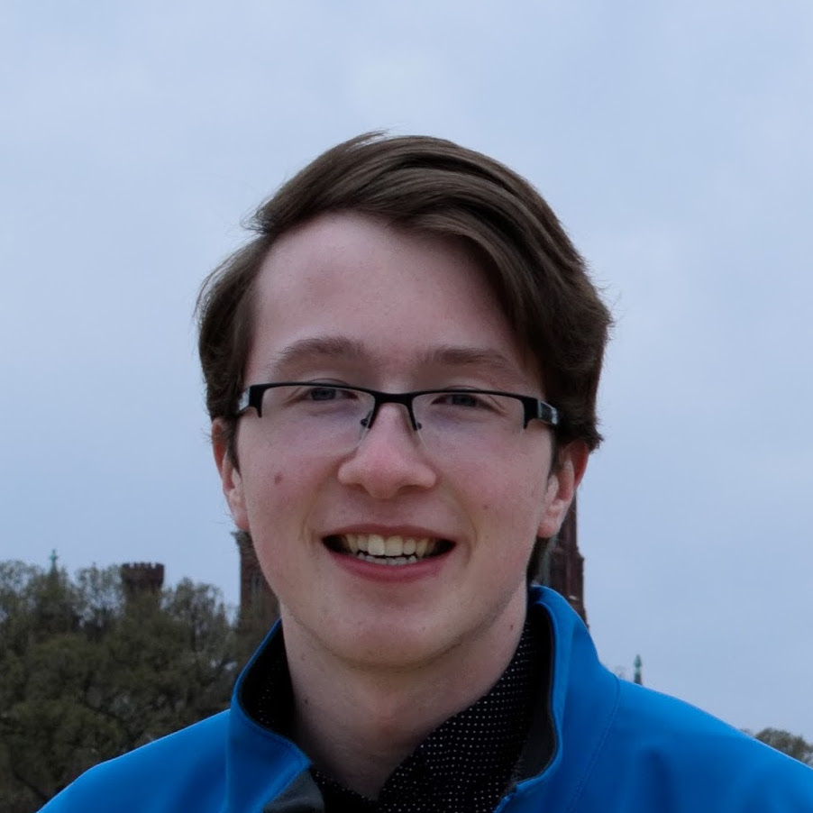

# Meet the Team

### Adam

**Learning goal:** Learn how to genetically define how a car drives.  
**Fun fact:** Adam's first words were "sudo pip3 install numpy"

### Alex

**Learning goal:** Gain a better understanding of evolutionary algorithms.  
**Fun fact:** Alex can juggle three hackey sacks while slacklining.

### Aurora

**Learning goal:** Improve my Python programming skills and learn more about car physics.  
**Fun fact:** Aurora is actually three cats inside a human suit.

### Gretchen

**Learning goal:** Gain a better understanding of evolutionary algorithms and physics modeling.  
**Fun fact:** Gretchen spirit animal is a bowl of plain oatmeal.

### Matt

**Learning goal:** Learn how to scaffold and handle working on a five-person project for six weeks.  
**Fun fact:** Matt is known to be a fan of the corn.
