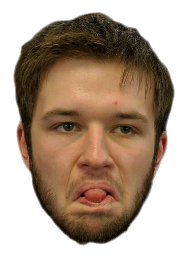
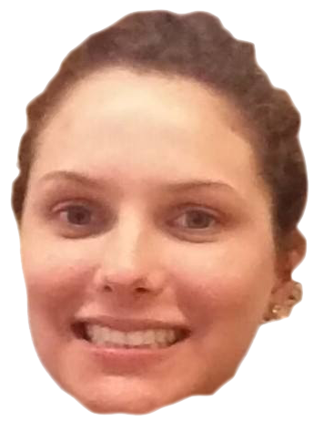
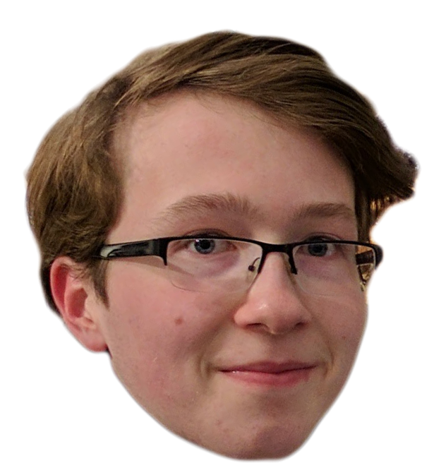

# Meet the Team

### Adam

**Learning goal:** Learn how to genetically define how a car drives.

### Alex
</img>
**Learning goal:** Gain a better understanding of evolutionary algorithms.

### Aurora
</img>
**Learning goal:** Improve my Python programming skills and learn more about car physics.

### Gretchen
</img>
**Learning goal:** Gain a better understanding of evolutionary algorithms and physics modeling.
### Matt
</img>
**Learning goal:** Learn how to scaffold and handle working on a five-person project for six weeks.
