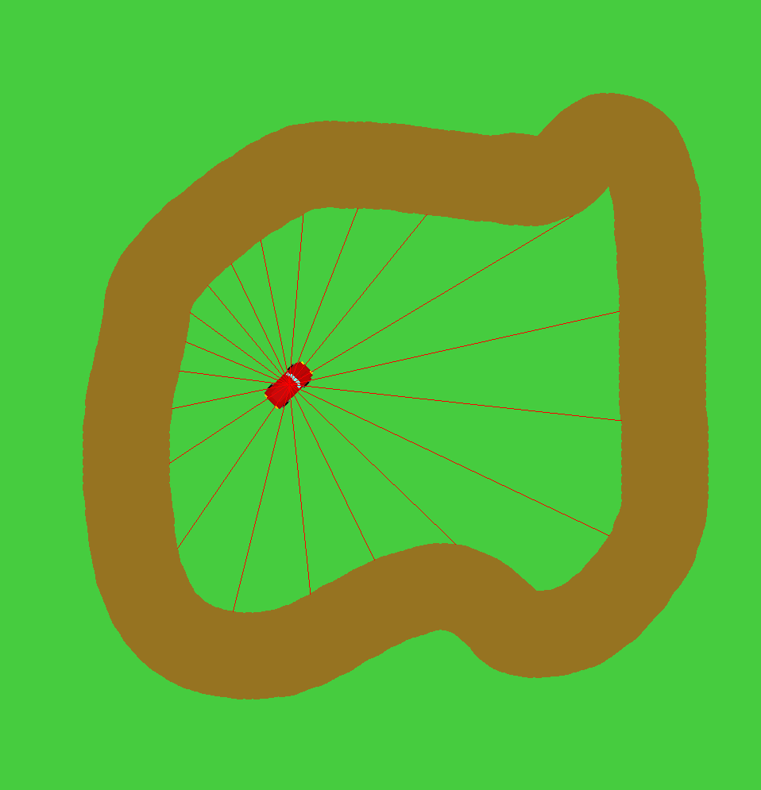
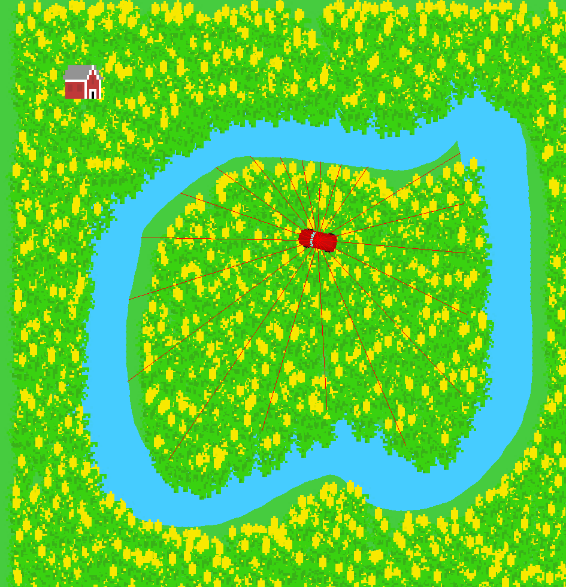
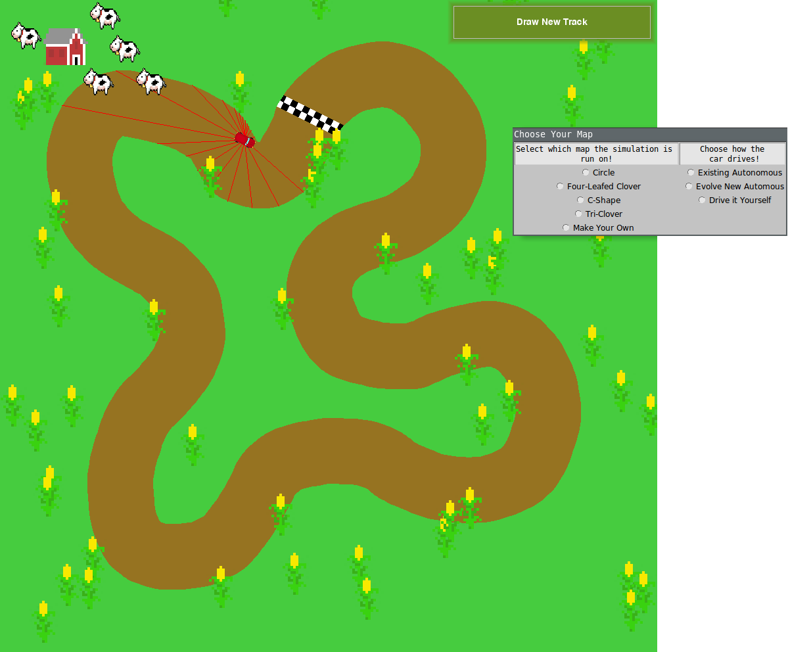

# Project Evolution/Narrative

We began this project with two intentions:
  1. To learn about some aspect of machine learning (particularly evolutionary algorithms)
  2. Learning how to create realistic physics simulations in Python

In the beginning, we wanted to create some sort of game/app combination that allowed for user-controlled driving in addition to the evolutionary driving. We set our MVP as being a single user-controlled car driving around a track with realistic physics.

### Building the Game

Based on feedback we received from our architectural review, we realized that just creating the self-driving car itself wouldn't create a very interesting user experience. As a result, we set out to add in more "game" elements, allowing for the user to control a car and race against AI-controlled cars. We were able to implement the basic elements of the "game" - i.e, user input and basic drawing functions - fairly quickly.

With simple input, this version of the game served as a proof of concept of our ideas - drawing LIDAR beams, controlling a car, and loading a "track" from a Numpy array.

### Machine Learning V1: Neural Network

Our first attempt at autonomous control was to use a neural network to control the car. None of us had any experience with building a neural network to tackle this sort of task, so we devoted a significant amount of time to understanding how to make it work. At the same time, though, we kept working on the physics, graphics, and user input functions to ensure that we weren't blocked by a lack of progress on the neural network front.

### :corn: The Corn Pivot :corn:

The first "pivot" in our project wasn't really a pivot - we hadn't decided on any particular thematic/aesthetic elements at the beginning of the project, so midway through the project, we spontaneously decided on a corn theme for the project. We created corn and barn sprites for the environment and created functions to randomly generate corn sprites.

### Pivot #2: Evolutionary Algorithms

Later into the project, we decided that neural networks wouldn't lead to anything fruitful within the remaining time of the project, and we pivoted to using a much simpler type of machine learning: evolutionary algorithms. Evolutionary algorithms proved to be much easier to incorporate into our project, since we'd already identified and programmed a very straightforward way of detecting where the car is: using the LIDAR beams. Using the DEAP library, we were able to set up an evolutionary algorithm which evolved to drive the car based on the LIDAR data.

### Incorporating Everything

The final major change we added, beyond minor user input/graphics tweaks, was to incorporate user choice into selection of track drawing and type of car control. We created dialog boxes which allow the user to select from a pre-built and pre-trained track, or to draw a new track; they also allow for AI control or user control.

In the end, we were able to accomplish just about everything we set out to do. Although we weren't able to implement multiple cars on a single track, we implmented all of the other physics, machine learning, graphics, and user input features we set out to do. :corn:
