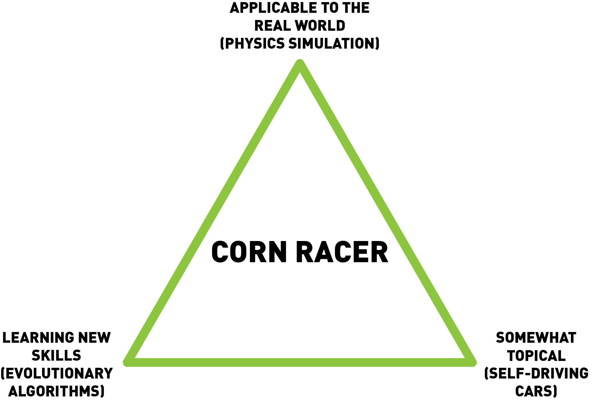

Corn Racer is a game where the user can either decide to draw a track and drive a car around it  or chose to play with machine learning and see a car maneuver a track by itself.
We built corn racer for three main reasons:

  * **Applicability to the real world:**
  A large part of the game was based off a physics simulator. We made it as accurate as possible so that the car would move in a realistic manner.
  * **Learning new skills:**
  While the main goal of this project was to learn about machine learning and evolutionary algorithms, we also learned a lot about the development and usage of graphics and of course the physics running the car.
  * **Ties to topical technology:**
  Self-driving cars are most likely the future of ground travel and a ton of research/development is going into them. We wanted to work with some of the components, such as LIDAR, of self-driving cars and apply it to our game.
