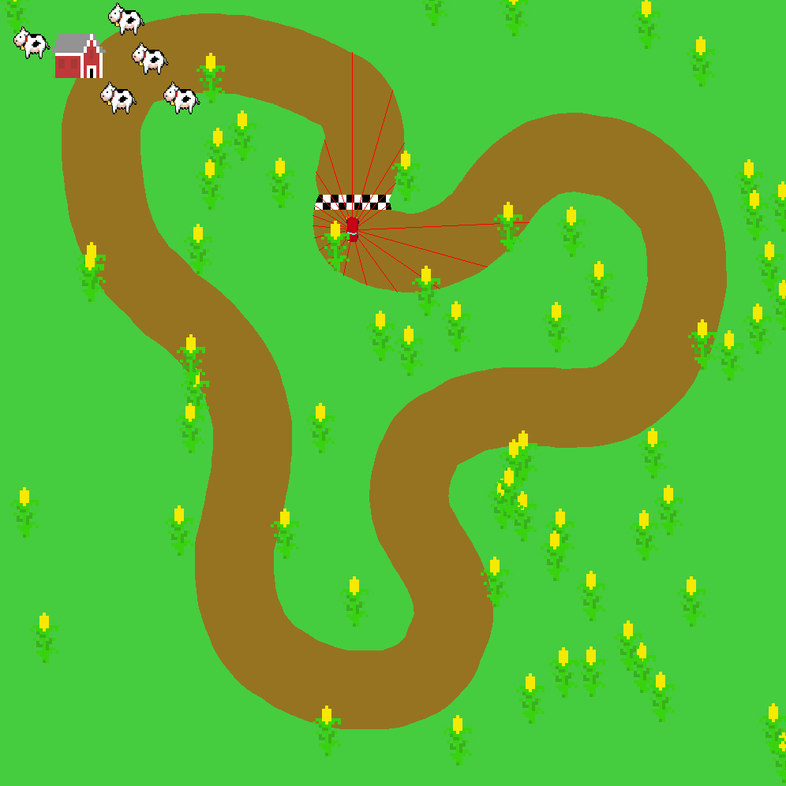

# Results
The final version of Corn Racer functions as a two-part system. The first is a user-controlled racing simulation. Using the mouse, a user can choose to draw a unique track which they can then drive a realistic car on. The second is a computer-generated car autopilot, which drives itself independent of any control.

Upon launch the user is greeted by two sets of buttons, one which indicates map selection (one of four pre-defined tracks, or the choice to draw your own) and one set which defines what mode the simulation launches in. The modes are the main focus of the project, and include:

  * User control
  * Pre-existing autopilot (evolved by us previously)
  * Generate new Autopilot

### Genetic Algorithms

The generation of a new autopilot is the core concept we set out to explore, and represents a pragmatic approach to machine learning utilizing a genetic algorithm to “evolve” different autopilots through a lengthy process of random mutation and fitness selection. ([Link](https://en.m.wikipedia.org/wiki/Genetic_algorithm)). These processes are described as “Commonly used to generate high-quality solutions to optimization and search problems by relying on bio-inspired operators such as mutation, crossover and selection.”(Mitchell, Melanie (1996). An Introduction to Genetic Algorithms. Cambridge, MA: MIT Press. ISBN 9780585030944.)

The final version of the autopilot uses a set of 20 simulated LIDAR (LIght Detection And Ranging) vectors to successfully navigate a user-drawn track. These vectors represent the distance from the center of the car to the wall of the track in 20 equally spaced directions around the car. These 20 vectors are then given random coefficient  values and added together, producing a single resultant vector. The car then moves based off of this vector, accelerating in relation to its longitudinal component, and turning according to the angle formed by the resultant vector and that of the car’s heading. Successive simulations are run with these random coefficients, and the distance the car travels is saved, both in a dictionary relating coefficients to distance for memoization purposes, and in a text file for logging. After each successive generation the best third of the population is selected using DEAP’s tournament functionality, and these coefficients are bred and randomly mutated to produce the next generation.

The result of this process is a car which, although slow, can successfully navigate a complex user-drawn track with hairpin bends and open corners. An interesting point is that the steering of the most successful cars actually functions fairly similar to a “bang-bang” PID controlled, operating at or near the opposite extremes of tire position.

### Performance

In terms of performance, the genetic algorithm seems to fairly rapidly converge on its local maximum value, spending the first 10 or so generations fairly rapidly increasing distance traveled. After these first iterations, the autopilot becomes fairly specific, and the addition of radically different parameters usually creates a less functional autopilot. The result of this is a diminishing return on each successive generation, with random mutation playing a large part in any incremental improvements.

# Try it yourself!
Check out our [Github repo](https://github.com/labseven/SoftDes-Final-Project) to download Corn Racer and play it for yourself!

# Pictures

# Project Videos

<iframe width="560" height="315" src="https://www.youtube.com/embed/986QFQm_fSU" frameborder="0" allowfullscreen></iframe>
